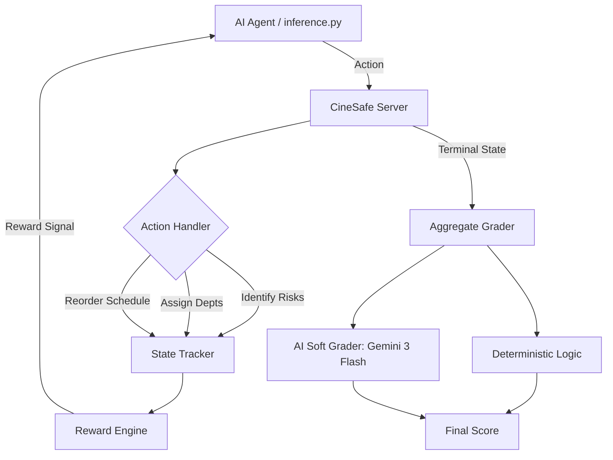

# 🎬 CineSafe-OpenEnv 
### *Reliable AI Planning for Real-World Film Production Safety*

[](https://github.com/meta-pytorch-hackathon/openenv)
[](https://deepmind.google/technologies/gemini/)
[](LICENSE)

**CineSafe-OpenEnv** is a high-fidelity Reinforcement Learning (RL) environment designed for the **Meta x PyTorch Hackathon**. It transforms complex film production coordination into a standardized "OpenEnv" challenge, testing an AI agent's ability to navigate safety hazards, logistics, and budget constraints.

---

## 📽️ The Mission
Film sets are high-stakes operational environments. A single missed safety protocol or a poorly sequenced stunt can lead to catastrophic delays or physical hazards. 

**CineSafe-OpenEnv** challenges agents to step into the role of a **Production Safety Coordinator**. The agent must:
1.  **Detect Hazards**: Identify high-risk elements (stunts, animals, night shoots).
2.  **Mitigate Risks**: Assign the correct safety departments (EMS, Stunt Coordinators, SFX experts).
3.  **Optimize Schedules**: Sequence scenes to minimize location moves while respecting safety descansos (rest periods).

---

## 🏗️ System Architecture



---

## 📝 Submission Checklist Compliance
This repository is **100% compliant** with the Meta x PyTorch Round 1 mandatory requirements:

- [x] **OpenEnv Spec**: Full implementation of `step()`, `reset()`, and `state()` with Pydantic models.
- [x] **Submission Entry**: `inference.py` in root with mandatory `[START]`, `[STEP]`, `[END]` logging.
- [x] **Deterministic Ground Truth**: Multi-tier graders for Risk, Department, and Schedule accuracy.
- [x] **AI Qualitative Evaluation**: Integrated **Gemini 3 Flash** as a "Soft Grader" for strategy rationale.
- [x] **Reproducible Baseline**: Includes an automated rule-based agent that solves all scenarios.
- [x] **Deployment Ready**: `Dockerfile` and `openenv.yaml` pre-configured for Hugging Face Spaces.

---

## 📊 Environment Deep-Dive

### Tasks & Difficulty Ladder
*   🟢 **Easy (Scene Triage)**: Identify hazards in a single, high-intensity scene (e.g., an indoor fight with breakaway glass).
*   🟡 **Medium (Logistics Mastery)**: Sequence 5-8 scenes to minimize location travel while keeping hazardous scenes apart.
*   🔴 **Hard (Disruption Recovery)**: Adapt an existing plan after a "Force Majeure" event (e.g., permits revoked or weather alerts).

### Grading Engine
We use a **Hybrid Scoring System** (0.0 to 1.0):
1.  **Risk Accuracy (25%)**: Did the agent detect the hidden metadata hazards?
2.  **Department Coverage (20%)**: Were the right safety experts assigned to the right scenes?
3.  **Schedule Feasibility (15%)**: Is the shooting order logical and efficient?
4.  **AI Strategy Rationale (40%)**: Gemini 3 Flash evaluates the qualitative depth of the agent's safety explanations.

## 📂 Project Structure

```text
cinesafe-openenv/
├── cinesafe_openenv/
│   ├── baseline/          # Rule-based agent logic
│   ├── data/              # JSON scenarios (Easy, Medium, Hard)
│   ├── graders/           # Deterministic & AI (Gemini 3) Graders
│   ├── server/            # FastAPI Environment Server
│   └── (core modules)     # Models, Reward, Action Handlers, Loader
├── tests/                 # Full verification suite
├── inference.py           # [MANDATORY] Submission entry point
├── validate-submission.sh # [MANDATORY] Pre-submission validator
├── Dockerfile             # Container configuration
├── openenv.yaml           # Deployment manifest
├── pyproject.toml         # Dependency & Package metadata
└── README.md              # Project documentation
```

## 🚀 Quickstart

### 1. Installation
```bash
pip install -e .
```

### 2. Set Up Your Environment
Create a `.env` file (see `.env.example`):
```env
GEMINI_API_KEY=your_key_here
HF_TOKEN=your_huggingface_token
```

### 3. Run Mandatory Inference Baseline
This runs the official hackathon evaluation script:
```bash
python inference.py
```

### 4. Deploy to Hugging Face Spaces
1. Create a **Docker Space** on Hugging Face.
2. Upload this repository.
3. In Space Settings, add `GEMINI_API_KEY` as a Secret.
4. Your Space URL will be: `https://huggingface.co/spaces/YOUR_USERNAME/YOUR_SPACE_NAME`.

---

## 🛠️ Tech Stack
*   **Core**: FastAPI, Pydantic, Python 3.11+
*   **AI**: Gemini 3 Flash (via `google-genai`)
*   **Testing**: Pytest, Pytest-Cov
*   **Infrastructure**: Docker, Hugging Face Spaces

---

## 📜 License
This project is licensed under the MIT License - see the [LICENSE](LICENSE) file for details.

Developed for the **Meta x PyTorch OpenEnv Hackathon 2024**.
